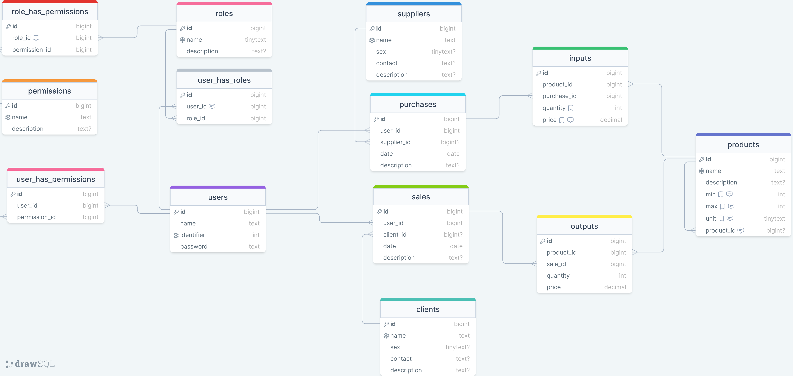

# top_stock_manager

Stock Management system for a small shop that runs locally, offline.

## Getting Started

This project is a local stock management system for a small business that buys and sells goods. This system will enable them
manage the movement of goods, the flow of money and will also help them know if to restock which product.

## Software name
The name of the software is `Top Stock Manager : Offline`
## Main Features
This will be a fully fledged system that reinforce access and permissions.
These features involve data handling.

### 1. Permissions
Each action of the system will be bundled with a permission. These permissions will be preset.

### 2. Roles
Each user role will group a set of permissions. These permissions can overlap among roles.
One role will be preset and cannot be modified nor deleted, and permissions attached will not be changed.
This will generally be the role of `Manager`.
- [ ] View all roles ;
- [ ] View one role ;
- [ ] Create a role ;
- [ ] Update a role ;
- [ ] Delete a role ;
- [ ] Attach or detach permissions to a role ;

### 3. Users
Users will be created and roles will be attached to them. The concept is that a user must have only one role attached. 
But we may evolve in the logic of one user with multiple roles.
- [ ] View all users ;
- [ ] View one user ;
- [ ] Create a user ;
- [ ] Update a user ;
- [ ] Delete a user ;
- [ ] Attach or detach role to a user ;
- [ ] Attach or detach permissions directly to a user (this is optional !) ;

### 4. Products
Products will be registered. The logic is that a product can constitute a category for other products.
E.g. `Biscuit` can be a product as well as a group of other biscuits like `Mousa Biscuit`, `Eat-sum-more Biscuit`, `Vap Biscuit`, etc
- [ ] View all products ;
- [ ] View one product ;
- [ ] Create a product ;
- [ ] Update a product ;
- [ ] Delete a product ;

### 5. Suppliers
Suppliers will be registered. Goods that are purchased will be recorded with their suppliers
- [ ] View all suppliers ;
- [ ] View one supplier ;
- [ ] Create a supplier ;
- [ ] Update a supplier ;
- [ ] Delete a supplier ;

### 6. Clients
Clients will be registered. Goods that are sold will be recorded with their clients
- [ ] View all clients ;
- [ ] View one client ;
- [ ] Create a client ;
- [ ] Update a client ;
- [ ] Delete a client ;

### 7. Purchases
A purchase is a set of different products purchased at once, usually from the same supplier. A purchase can have no supplier if that is not necessary
- [ ] View all purchases ;
- [ ] View one purchase ;
- [ ] Create a purchase ;
- [ ] Update a purchase ;
- [ ] Delete a purchase ;

### 8. Sales
A sale is a set of different products sold at once, usually to the same client. A sale can have no client if that is not necessary
- [ ] View all sales ;
- [ ] View one sale ;
- [ ] Create a sale ;
- [ ] Update a sale ;
- [ ] Delete a sale ;

### 9. Inputs
An input is a set of many quantities of the same product purchased at once, usually many inputs done at the same time from the same supplier will constitute a purchase.
A purchase may have only a single input, and that single input can be constituted of one item of one product.
- [ ] View all inputs ;
- [ ] Create a input ;
- [ ] Update a input ;
- [ ] Delete a input ;

### 10. Outputs
An output is a set of many quantities of the same product sold at once, usually many outputs done at the same time to the same client will constitute a sale.
A sale may have only a single output, and that single output can be constituted of one item of one product.
- [ ] View all outputs ;
- [ ] Create a output ;
- [ ] Update a output ;
- [ ] Delete a output ;

## Secondary Features
Apart from the main features mentioned above, other features will be included.
These are the treatment of data.

### 1. Login and Logout
Users will log in and out of the system to use it for security reason.

### 2. Dashboard
Dashboard will display daily purchases and sales of products. 
It will show a list of 5 most sold products. 
It will signal products that have reached critical minimum or maximum stock.

### 3. Reporting
#### 1. Sales Reporting
Sales will be reported in different ways :
- [ ] Daily reporting ;
- [ ] Weekly reporting ;
- [ ] Monthly reporting ;
- [ ] Custom date range reporting ;

#### 2. Purchases Reporting
Purchases will be reported in different ways :
- [ ] Monthly reporting ;
- [ ] Custom date range reporting ;

#### 3. Critical Stock Reporting
Critical stock level will be reported in :
- [ ] List reporting : indicating the product, the quantity level, percentage of the minimum level, better if above 1OO% ;

## Other Features
We may include other features.
- [ ] Printing of sale's receipt ;
- [ ] Viewing level of sales done by a user fo a given period: e.g. a month ;
- [ ] System software update ;
- [ ] Developer communication with users ;
- [ ] Developer notification to user ;

## Database backup
Backup features may include database exporting and importing, as well as online syncing for backup purposes only.

## Database Modeling
